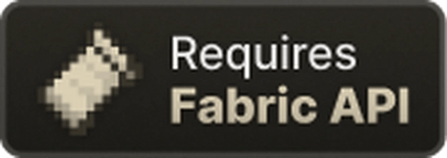
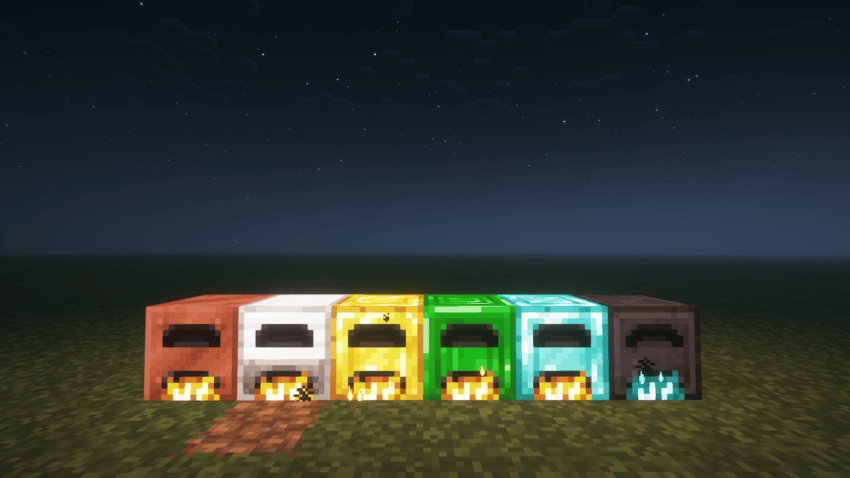

# Fox Furnace

Fox Furnace adds new furnaces that can be made with vanilla materials, providing faster cooking speeds and enhanced smelting capabilities for your Minecraft experience.

## Features

- **6 Different Furnace Types**: Each with unique cooking speeds and crafting requirements
- **Vanilla Materials Only**: All furnaces can be crafted using standard Minecraft materials
- **Configurable Cooking Speeds**: Adjust furnace speeds through the config file
- **Seamless Integration**: Works perfectly with existing Minecraft mechanics

## Requirements

- **Fabric API** - Required for mod functionality
- **Cloth Config API** - Required for configuration management

## Available Furnaces

The mod includes six different furnaces, each offering improved cooking speeds:

- **Copper Furnace** - Entry-level upgrade with moderate speed boost
- **Iron Furnace** - Reliable mid-tier option with good efficiency
- **Gold Furnace** - Fast cooking speed with golden efficiency
- **Emerald Furnace** - Premium furnace with excellent performance
- **Diamond Furnace** - High-end furnace with superior speed
- **Netherite Furnace** - Ultimate furnace with maximum cooking speed

## Configuration

The cooking speed for each furnace can be customized through the configuration file. This allows you to balance the mod according to your gameplay preferences and server requirements.

## Installation

1. Make sure you have Fabric Loader installed
2. Download and install Fabric API
3. Download and install Cloth Config API
4. Download Fox Furnace mod file from [CurseForge](https://www.curseforge.com/minecraft/mc-mods/fox-furnace)
5. Place the mod file in your `mods` folder
6. Launch Minecraft with Fabric profile

## Compatibility

- **Minecraft Version**: 1.21.1
- **Mod Loader**: Fabric
- **Dependencies**: Fabric API, Cloth Config API

## License

This project is licensed under the MIT License - see the [LICENSE](LICENSE) file for details.

## Support

If you encounter any issues or have suggestions for improvements, please report bugs on the [Issues](../../issues) page.

## Credits

Created by [Piofox4]

---

*Enhance your smelting experience with Fox Furnace - where efficiency meets vanilla compatibility!*